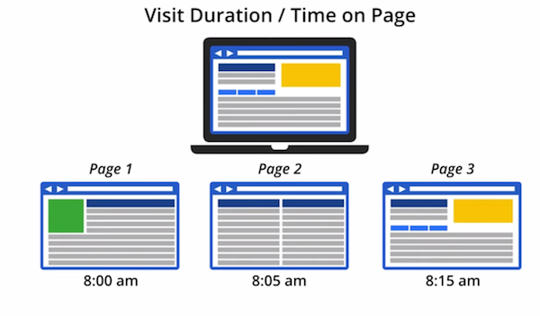
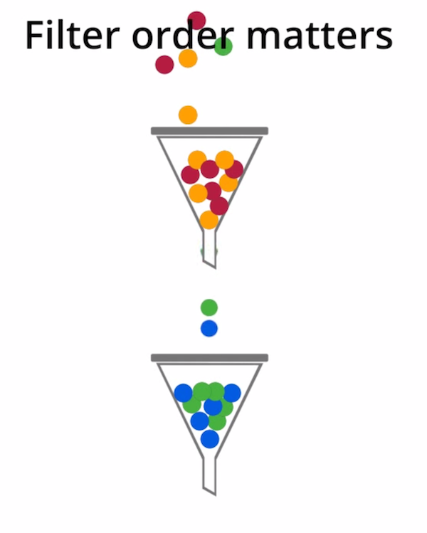

#Google Digital Analytics Foundation Notes 

##1.A. Importance of Digital Analytics
	Factors to bring the importance of analytics
		- Internet
		- Mobile
		- Cloud Computing

		

	- Avinash Kaushik's definition
		"Digital analytics is the analysis of qualitative and quantitative data from your business and the competition to drive a continual improvement of the online experience that your customers and potential customers have which translates to your desired outcomes (both online and offline)."

		

	-Key Elements of Google Analytics:
		- Customers:
			- Long time,we had a marketing funnel 
			(awareness > acquisition > engagement > conversion > retention)
			- The best analysis is through the customer!
			Successful, realistic, holistic information!
		- Qualitative (What)
			- Google analytics can take large amount of data through websites
			- Long time, but now has more value
			- Home appliances, mobile, game, computer, etc.
			- Find behaviors that are unexpected or erroneous
		- Qualitative (Why)
			- Make general assumptions to why behaviors occur
			- Inferences to segmented data values
				- Examine if this is specific and methodological
			- Understanding people's motivations
		- Best of both worlds
			- Qualitative data with Qualitative analysis and response to determine trends and behavior of your customers
		- Measuring outcomes
			- What are the important business outcomes, and what your goals are
			- Good to have a good strategy 
			- 5 business objectives:
				- E-commerce: sell products
				- Lead generation: contact information for sales prospects
				- Content publishing: ads shown to visitors
				- Online info: help customers and respond quickly
		- Behavioral data
			- Macro Conversions
				- Main objective
			- Micro Conversions
				- Smaller steps to the final goal
		

				

	- Continual improvement (Whole Process)
		- Measure: all data needed to answer business questions
		- Report: Send information for those who can use it like reporting
		- Analyze: Segmentation and hypothesis, and determine expectations (then find out why or why not it didn't meat)
		- Test: Different solutions to the problem
			- takes things out of the decision making process
		- Improve: Learn from your last cycle to make a better next cycle
	    - This flow should have qualitative and quantitative data to help you get to know your customers and their behaviors. 

Know the importance of genre, and how we interact with the customer and what we do with it! 

##1.B. Core Analysis Techniques

###Segmentation
    - Aggregated data tells you trends, and more importantly the change of trends
	- Identify similar customers, and understanding those trends
    - Breaking up into segments allows you to understand trend changes, and prioritize in the aggregate
    - Common segments (isolate and analyze):
    	- days of the week and hours of the day
    	- Devices / Operating System
    	- Marketing Channels (email, twitter, search)
    	- Geography
    	- Customer characteristics (repeat or first-time)
	- Segmentation can help you find the underlying causes of changes to your aggregate data.
	- Segmentation allows you to isolate and analyze subsets of your data.
	

###Context
	- Internally vs. Externally
		- External:
			- If booms are from company trends or trends within the industry
		Internally:
			- Finds Histroical data to represent benchmarks
			- Using your site's historical monthly visits data to set a future monthly visits target.
	- Using both to determine areas of goals, and importance of goals under the scope of the industry and company's interests.
	- When plotting and understanding quantitative information, everything breaks down to context to understand the better qualitative values
	

##1.C. Conversion & Conversion Attribution

###Macro Conversion (channel 1)
	- Completes an Action as a desired business goal
	- E-Commerce: Transaction
	- Sales Leads:
		- A potential customer fills out and submits a lead form.
	
###Micro Conversion (channel 2)
	- Better understand the journey of your customers
	- Indicator that a user is moving toward a macro conversion
	- Maximize Sales:
		- Ecommerce conversion rate
	
###Attribution is assigning credit to each conversion
	- Assigning Credit for a Conversion
	- Understanding Attribution channels:
	    - Assists
	        - Interactions occurred before the actual attributions
	        - Which players assist to the end result
	    - Goals
		    - Some score goals
		    - Need to know which one is used
	- Channel Grouping Path (inside Google Analytics to understand common attributions)
	- Common attribution mistakes:
		- keywords under research may be misguided when tracking attributions
		- Just because keywords are not highly visible in ads, etc, removing them may be harmful.
		- Case Study:
			- Winery (Winery wedding venues)
				- Customer's search very broad, and then find information down the funnel
				- Then when the submit the form, they just look up the name and go straight to the website
		- Data-Driven doesn't tell the whole picture
			- Need to be mindful of all attributions that may not be physically tracked (like different devices)
				

	- Last Click Attribution (all the data goes to the last conversion)
		- Oldest Attribution 
		- Using the last step as the major attribution to bring about the macro conversion
		    
		    

	- First Click attribution
		- Determining if a channel is good for initiating sales. One big example is a youtube for sales videos that bring major product sales

		    		

	- Linear Attribution
		- Assigning assisting attributions
		- This is very commonly explained with ads, social media and other assists that customers see over time to get them to a full macro-conversion
	
		

General idea: better understand the journey and to determine what process is best. More atttributions at: https://support.google.com/analytics/answer/1665189
		

		
The above question was ambiguous, but more explained it is asking what are the values depending on each of the above attributions. 

##1.D. Measurement Plan

### Channel the implementation for your needs
	-Needed: 
		- Time and effort, people, technology
		- People:
		    - Business Objectives/ Strategies
		    - Understand what analytics does
		    - How to implement Analytics
		- What you measure:
			- Define measurement plan
			- Document technical infrastructure (responsive design, mobile, etc)
			- Creating an implementation plan ( defining the code snippets, and tags required)
			- Web developer / mobile developer team to implement these changes
			- Maintain and refine to keep up with industry

		

	- Measurement Model: (Avinash's model)
		-Start with business objectives!
		- Digital Strategies 
		- 5 Steps of MEasurement plan:
			- Document Business Objectives
			- Identifiy strategies
			- choose KPIs
			- segmentations
			- choose targets

				

		- Case Study (outdoor equipment company) :  Blog, personal website, and live store
			- Business objective: Help people enjoy the outdoors through innovative products and cultivate their love of the outdoors
			- See below for full explanation:
		        - The segments you choose can be the same or different for each of the different devices
	            - Involve your IT Team to document technical insfrastructure
		            - Business needs -> Implementation Plan
		    	        - Query STring parameteres
		    	        - String Redirects
		    	        - Flash and Ajax events
		    	        - multiple subdomains
		    	        - Resopsonsive web design
		        - Create your Implementation PLan
			        - Standard dimensions: basic page tag & metrics
			        - Business outcomes -> goals & e-commerce
			        - clean, accurate data -> filters / settings
			        - marketing channels -> campaign tracking & adwords
			        - simplified reporting -> custom reports & dashboards
		        - Robust implementation plan may need to be done in phases!
	        

		- Implementation plan:
			- Define Measurement plan (business + tactics, segments, etc)
			- Document Technical (IT Team)
			- Implementation Plan (
			- Implement ( developers )
			- figuring out time constraints and possible phases.
	
###2.A. How Analytics Works

##Collection:
	- Javascript code on every page, collects information right away.
		- browser, os, and gestures, as well as what brought them there
	    - Hit interaction is each action
	    - Large amount of data is just acquired from the snippet
	- Case Studies:
	    - Loyalty program for planes:
	    	- Collect data for frequent flyer miles
	    	- Tracking more specific than just GA
	-Mobile:
		- Each operating system is different
		- tracking is based after activies instead of page views
		- Mobile hist from offline devices can be stored and dispatched to Google each time it connects to the internet
		- Knowledgeable developer is required
		Case Studies:
			- Hit on store location
			- Purchase date, etc

###Data Processing:
	- turns your raw data into something more usable
	- categorizes mobile/non mobile/etc
	
###Configuration
	- add filters, etc
	- Choosing different types of data to be pre-sorted
	- Stored into the database after Data/Configuration
	- Setup, then saved, and cannot be changed (??)

### Reporting
	- Uses all of the information stored and bring informative information to the table
	

###Breakdown (Case Study):
	- Website (includes code)
	- Code sends information to GA, where the data then sends through the cogs of GA.
		- Flowing into the processing image
	- Then flows into a database
		- Pre calculated and stored
		- Day Of Week, and then stored into the database with google's database dables
	- Views then populate reports from the database
		- Views can be populated for each property (inside google analytics)
		- Views have different configurations also
			- Content grooping, filters, and e-commerce	
	        - minimum session timeout
	        - change timeout for compaigns, etc.
		- Used to see a specific subset of the data
		- Views can have filters that also re-catagorize data, to make processed data to be the clearest informative reports as possible.
	- Issues:
		- if done wrong, you can create views that don't fill in gaps
		-Case Study (If an entry goes to blog, then www, then back to blog.) 
			- Accurate amount will track the blog visitation will be blog-www
			- However, if just tracking blog it will be the entire visit (because www is lump summed without tracking)
			- If we just see the session of www, then we measure the timestamp			 and it would show 0 or very little visit, even tho it is actually 140 seconds.
		- Data isn't wrong, it's just not accurate nor completely correct.
	- Don't limit your session tracking to just one page, it is only relevant when tracking the session through the entire site. It's all relative, and not absolute on single page visitation). 
	
##2.B. Key Metrics * Dimensions

### Dimensions
	- Characteristics of your users and sessions
	- Types:
	    - User Dimension
		- Session 
		- Interaction		

### Metrics
	- Quantitative measurements of users (sums, averages and ratios)
	- Numbers!
	- Types:
		- Audience
		- Behavior (averages of pages for engagement)
		- Conversion (take valuable actions)
	    - Visitors / Users
		    - New
		    - Returning
		- Sessions or visits (timeout is default 30 minutes)
			- Move up the default timeout if session timeout
			- Videos should have hits by percent played
			
### Dimensions vs Metrics 
	-(often displayed in a table)
	- Websites (Case Study):
		- Google Analytics will track interactions with page views
		- Tracking watching a video (using events)
		- Sessions expire without events and user activity

	

	    - Can Calculate user duration:
	    	- Time on page: landing on a time, from subtract next time view
        - Bounce Rate
	        - The percentage of sessions with only one user interaction
	        - visit duration, and time on page = 0!
	        - Why?
	        	- wrong product, or can't navigate
	        	- Blogs are okay
	    - Using AJAX and Flash: ADD EVENTS!
	- Larger list of events: support.google.com/analytics

##3.A. Adding an Account
	- start new account
	- Choose mobile or web (download SDK if possible)
	- Must have analytics snippet on every page. OR Tag manager is another process ( Analytics web property ID)
		-> Tag Manager you need a data layer and GA
		-> Tag manager then imports into the page for tag behaving
	- Put the snippet of google analytics in the last area of the header
	
###Tag Manager vs Analytics
	- Tag Manager is a way to put all kind of tags into your system.
		- It is the box to track behavior
		- Tag: Piece of code that goes into a site
			- Managing them without having to go through the developer teams
	- Analytics is a system to get data into your system
		- It puts stuff in the default box and tracking the behavior
	
##3.B. Understanding your Account
	- Structure of google account (Logical representation to represent data for your business)
	-Each account
		- Multiple Properties: stored and referenced together
		- Each account should be related aspects of the same company
		- Data is actually stored and tracked differently
		- Roll-up Reporting (non-premium):
			- To track multiple sites 
			- Have to change the implementation
			- Necessary for the question: (How many page views across multiple sites that you don't want to two places to look at)
			- Only one tag!t
	- Create multiple views for each property
		- Views depending on region, etc for different business teams
		- 3 views for each property
			- Unfiltered
			- Master View (to transform your view)
			- Test view
		- 2 more views for mobile:
			- tablet only
			- smartphone table
	- Once data is processed, it cannot be reprocessed
	- Once a view is deleted, it cannot be brought back
	- new views start reporting data from the date of creation
	- Develop your measurement plan before setting up any of your views and properties 

##3.C. Filters
	- Filters provide a flexible way of modifying the data in each view
		- exclude, include, and change data 
		- transform data for reporting each view
		- Analyze data only by customers and not employees
			- Filter all IP addresses from your business
	- Clean up data
		- removes case issues and transforms page views into lowercase, so the aggregate is more accurate
	- Conditions:
		1. Filter field (defaults are URI, etc).
		2. Rules (matching or not matching patterns)
		3. Choose the action (include, exclude, change)
	- Types:
		- Predefined
		- Custom
	-Case Study (excluding employees)
		- Predfined filter,
		- exclude URIs
		- Equal to IP address
	- Case Study (lowercase):
		- Lowercase
		- Filter field request URI

		

	- Filters can also:
		- Exclude, include, change, lowercase, uppercase
		- Advanced: remove, replace and combine fields
		- Difficult to add multiple filters to the same page
		- Filter order matters! (one flows to the next)
	- Stored in Filter Library!
		- Plan first, and investigate business goals
		- Put filters in your test view first!!!

##3.D. Goals & E-Commerce
	- Tracking Macro & Micro Conversions through goals
	- Setting up goals is one of the most important!
	- Review Key Performance Indicators from 5 step process
	- Macro vs Micro
		- Macro are the business goals for our customers
		- Micro is the relationship building activities
	- Conversions & Conversion rates
		- Traffic sources report
	
###Goals:
	- Goals for each view:
	- Types
		1. Destination Goal 
			- Page you see after you finished your macro conversion
			- Options:
			Specify Name & Goal Details & Confirmation & value & Funnel
				- Name & Details: 
					for example any page that (begins with/equals to/regex) /thankyou creates destination goals		
				- Confirmation testing
				- Monitoring monetary value for each conversion (sales or custom value for each page)
				- Funnel (checkout process)
					- Screen/page & name for each step
					- Multi-funnel conversion paths
				- Also use E-commerce reports 
					-To Use:
						- ecommerce settings!
						- analytics code on transaction complete page
						- e-commerce code for transaction complete page
		    - Goal Conversion vs E-commerce
		    	- Goal conversion hits only once where e-commerce happens multiple times
		    	- Case Study (Download $5 PDF & download five times)		    	
		    		- Goal: : 1 Goal, $5
		    		- E-commerce: 5 transactions, $25
		    - Only add "goal value" for non-e-commerce goals, otherwise revenue will be double counted
		2. Event Goal
			- Download PDF or starting a video
		3. Pages per visit
			- Triggered when customer sees more or less 
		4. Time on site
			- exceeds or within the threshold

##3.E. Collecting information and Campaign Information

## Choose Segments (Marketing Campaigns)
	- Captures attributes/dimensions of where they came from
		- Source: google.com, facebook, etc.
		- Medium: Unpaid search (organic), Referral (from another site/non search), None (Directly to your site or clicking on a bookmark)
			- Campaigns (Link Tagging)
				- Social, Email
			-News Letter (Campaign tags to identify where the user came from, email, etc.)			- Source: Julynews, 
				- Medium: email, 
				- Term
				- Campaign: summersale
				- Content: versions
		- Use Campaigns to correctly understand where people are coming from
			- Link Tagging:
			    - Very good idea to contain an internal spreadsheet to groups campaign names/channels to keep data concise and informative
		        - Use all traffic report to see Source / Medium
		        - Campaigns are in the campaign report
			        - Change primary dimension to add content in reporting
			    - Magic for GA is putting parameters on your data.

##4.A. Reporting 
	- Reporting Interface (plot-able visits and table data)
	    - Change the data range
	    - View options:
	        - Graph data & plot data
	        - Percentage views in pie charts
	        - Performance view is Bar graph based.
	        - Comparisons: to view average and relations to the average.
	        - Selecting Specific rows that can be plotted
	    - Comment
	- Filter and sort data
		- Using filters you can see only the data that represents toward your goal
	- Adjust which metrics appear in reports
		- Categorize under multiple dimensions to breakdown data further 
	    - Pivot Table 
	- Go to the Interface and start playing around!
	
##4.B. Audience Reports

###Understand Characterstics of Users
	- Devices, and geographical
	- Also understands user behaviors even between multiple events
	- Understand user behavior and frequency
	- Access Geographic Data
	- View mobile
	
##Interface Walk through
	- Location
		- Represent possible untapped markets
		- Add in average value, and see least regions of your market audience
			- possible help others and focus on specific regions
		- Identify regions you have a large bounce rate, and may need to be optimized for  language, etc for ads
	- New Vs. Returning Report
		- Compare ratios of your audience 
		- Caleb's comments:	
			- New Visitors is initiated only on cookie creation
			- "Newish" is lost, and create a segment for count of visits
				- Count of visits 1-4 and their distance from first visit is less than 2 days
			- Customization is very important to get precise data
		- Investigation can help determine frequency reward program
	- Frequency Report
		- Count Of Visits
			- Helps determine issues like wrong audience or even helps explain how successful you are in your industry
	- Engagement
		- duration in seconds, and page views
		- Contact information 
	- Technology:
		- Fine tune current versions and next versions
			- Help determine developer cycles
			- Bounce rate on specific devices may need to push for new development cycles
		- Mobile Devices:
			- Name, Brand, Service Provider, Input Selector, OS, Screen Resolution
			- Gives developers on where to focus and build
		- Custom Dimensions (demographic data, industry, etc)
			- Powerful tools to understand your customers

##4.C. Acquisition Reports
	- How people find your website/app
		-which channels and tactics to give the highest quality traffic
	- All Traffic:
		- referrals, direct, organic and the source
		- google: organic vs cpc (cost per click)
		- Did the traffic help you achieve your goal?
			- See bounce rate
			- Compare to site referral (example: youtube source results in customers may not find what they are looking for)
			- Landing Page as a secondary dimension to see another layer of analysis of metrics
	- Campaigns
		- Traffic assigned to campaigns (auto tagging may help)
		- Compare various marketing efforts side by side
		- "Other" drop down to see ad content information
	- Caleb's 2-cents
		- Goal / Value (super metric) -> E-commerce
		-> Per Session Goal Value (seen in relative comparison)
		-> Per Session Goal Value is more informative because it tends to be relative to the actual goals
			-> unlike goal conversion rate that assumes only 1 goal per page
			-> Use this for information on how to plan out your marketing schedule
		
	

##4.D. AdWords Reports

###Google AdWords Performance
	- Specific to AdWords
		- How they impact Campaign performance
		-RLI / Revenue Per Click
	- View Adwords, Metrics, and impact of AdWords specific features
	- Site View Metrics
	- Revenue Metrics
	
###Interface Walkthrough
	- Campaign and list AdWords groups
	- Help you understand how usable your ads are in e-commerce
		-> Then Ad Groups 
		- Visits are # of visits
		- Impressions are # ads displayed
		- Clicks are # of clicks 
		- Cost & CTR 
		- ROI = (Revenue adwords visit - adwordscost) / adwordscost
		- RPC (0) and ROI (-100%) means not completely setup correctly
	- Setup correct date ranges!
		- At least as long as your sale cycle
	- Bid Adjustments report
		-  Top left: campaign names
	- Adwords Keywords
		- Broken up by keywords in your search campaigns
		- which ones end up meeting goal completions or which ones have large bounce rates
	- Matched Search Queries
		- See which keywords were used to get your site
		- Can revaluate rebidding schedule, and formulate days and times to be more competitive
	- Destination URLS
	- Placements
		- Show you were the domains and specific urls where your ads are placed
	- Keywords display how your keywords are used and their performance clicks
	
###Question:
	- Automatic vs Managed displayed
		- Display ads on websites
		Managed
		    - Tell you your budget
		    - Adjust
		Automatic:
			- Send in your information, and google will populate your target sites
			
		
 
##4.E. Behavior Reports
	- How users interact with your site/app
	- Valuable data on how users get to you from search engines
	- Identify popular content
	- analyze how users move on your site
	- analyze site search data

###Interface Walkthrough
	- Pi Chart view to see what pages are used most
	- Looking for high bounce rates to see what pages need to be redesigned 
	- High Exit Pages on landing pages could be problematic
	- Top Events Report
	    - Ajax, flash, etc need to be tracked with events
	    - Video or Downlaods could be good categories
	    - Video: Play & Video: Stop for video interaction
	    - Can set a value for each event
	    	- Value could be load time for each video
	- Search Terms
		- Analyze what people search for to determine hidden content on your site
	    - Refined search as secondary dimension to see what people had to refine their search to find your site
	    - Time after search
	    	- Amount of time customers are on the site after they seearched
	- Behavior Flow Report
	    - Clicking on a page you can see how effective that page is used as a launch page
		- Blue is Event, Green is typical behavior
		
##4.F. Custom Reports & Dashboards

###Custom Reports
	- Includes all the data you need
	- One simple report for all the information that is specific to each purpose
	- How To create
	- how to create a dashboard
	- hot to share
				
###Interface Walkthrough
    - Name
    - Type
	    - Explorer type shows with table with graph on type
	    - Flat table is only related to table information
	    - Map overlay is for geolocation
	- Metrics
		- Visits, Goals, etc
	- Dimension Drilldowns (some cannot be paired)
		- Primary characteristics
	- Filters (optional)
		- Include/Exclude and comparison for the hash
	- Profiles (optional)
		- Add them to other shared profiles
	
###Dashboard
	- Represent multiple elements of your projects as widgets
	- Add new widgets to give you front page information
		- Widgets have customization options for metrics, scale, etc.
		- Can share widgets
	- Can Share Dashboards
	- Keep in mind of your planning process when building your dashboards!

<!--- Stylizing for personal use ---->

