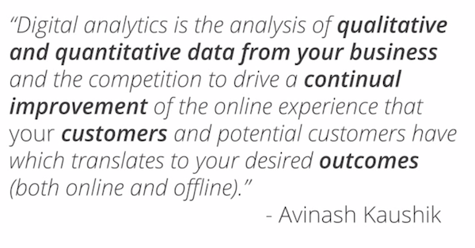
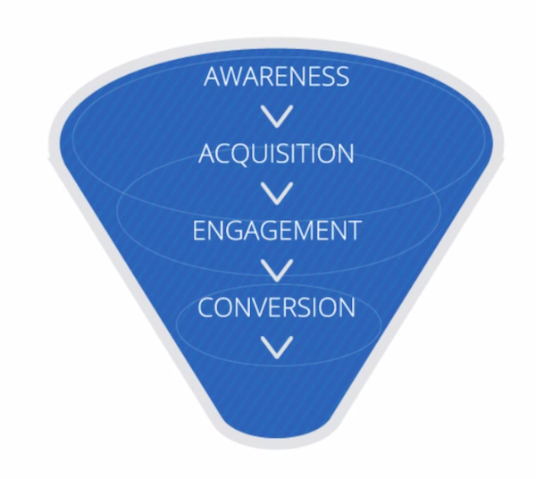
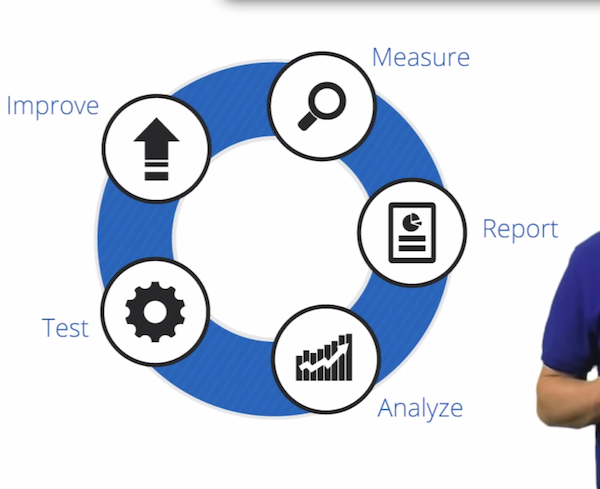
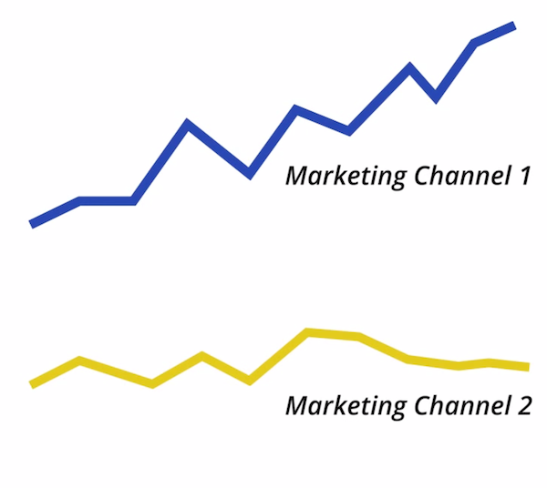
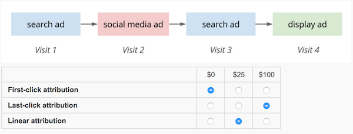

##1.A.
	Factors to bring the importance of analytics
		- Internet
		- Mobile
		- Cloud Computing

		

	- Avinash Kaushik's definition
		"Digital analytics is the analysis of qualitative and quantitative data from your business and the competition to drive a continual improvement of the online experience that your customers and potential customers have which translates to your desired outcomes (both online and offline)."

		

	-Key Elements of Google Analytics:
		- Customers:
			- Long time,we had a marketing funnel 
			(awareness > acquisition > engagement > conversion > retention)
			- The best analysis is through the customer!
			Successful, realistic, holistic information!
		- Qualitative (What)
			- Google analytics can take large amount of data through websites
			- Long time, but now has more value
			- Home appliances, mobile, game, computer, etc.
			- Find behaviors that are unexpected or erroneous
		- Qualitative (Why)
			- Make general assumptions to why behaviors occur
			- Inferences to segmented data values
				- Examine if this is specific and methodological
			- Understanding people's motivations
		- Best of both worlds
			- Qualitative data with Qualitative analysis and response to determine trends and behavior of your customers
		- Measuring outcomes
			- What are the important business outcomes, and what your goals are
			- Good to have a good strategy 
			- 5 business objectives:
				- E-commerce: sell products
				- Lead generation: contact information for sales prospects
				- Content publishing: ads shown to visitors
				- Online info: help customers and respond quickly
		- Behavioral data
			- Macro Conversions
				- Main objective
			- Micro Conversions
				- Smaller steps to the final goal
		

				

	- Continual improvement (Whole Process)
		- Measure: all data needed to answer business questions
		- Report: Send information for those who can use it like reporting
		- Analyze: Segmentation and hypothesis, and determine expectations (then find out why or why not it didn't meat)
		- Test: Different solutions to the problem
			- takes things out of the decision making process
		- Improve: Learn from your last cycle to make a better next cycle
	    - This flow should have qualitative and quantitative data to help you get to know your customers and their behaviors. 

Know the importance of genre, and how we interact with the customer and what we do with it! 

##1.B.

###Segmentation
    - Aggregated data tells you trends, and more importantly the change of trends
	- Identify similar customers, and understanding those trends
    - Breaking up into segments allows you to understand trend changes, and prioritize in the aggregate
    - Common segments (isolate and analyze):
    	- days of the week and hours of the day
    	- Devices / Operating System
    	- Marketing Channels (email, twitter, search)
    	- Geography
    	- Customer characteristics (repeat or first-time)
	- Segmentation can help you find the underlying causes of changes to your aggregate data.
	- Segmentation allows you to isolate and analyze subsets of your data.
	

###Context
	- Internally vs. Externally
		- External:
			- If booms are from company trends or trends within the industry
		Internally:
			- Finds Histroical data to represent benchmarks
			- Using your site's historical monthly visits data to set a future monthly visits target.
	- Using both to determine areas of goals, and importance of goals under the scope of the industry and company's interests.
	- When plotting and understanding quantitative information, everything breaks down to context to understand the better qualitative values
	

##1.C.

###Macro Conversion (channel 1)
	- transaction
	- Sales Leads:
		- A potential customer fills out and submits a lead form.
	
###Micro Conversion (channel 2)
	- indicator that a user is moving toward a macro conversion
	- Maximize Sales:
		- Ecommerce conversion rate
	
###Attribution is assigning credit to each conversion
	- Last Click Attribution (all the data goes to the last conversion)
		-used for years, because it was best we had)
	- Linear Attribution ??
	    - Assists
	        - Interactions occurred before the actual attributions
	        - which players assist to the end result
	    - Goals
		    -Some score goals
		    -need to know which one is used
	- First Click attribution
		- assigning assisting attributions
		

General idea: better understand the journey and to determine what process is best.
		

		
The above question was ambiguous, but more explained it is asking what are the values depending on each of the above attributions. 

##1.D.
