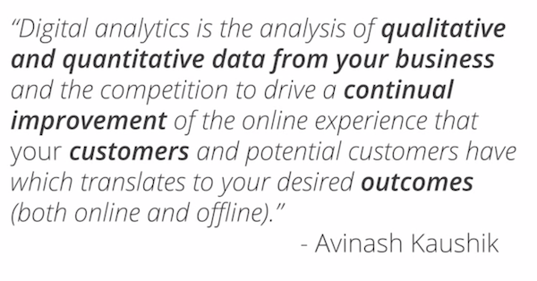
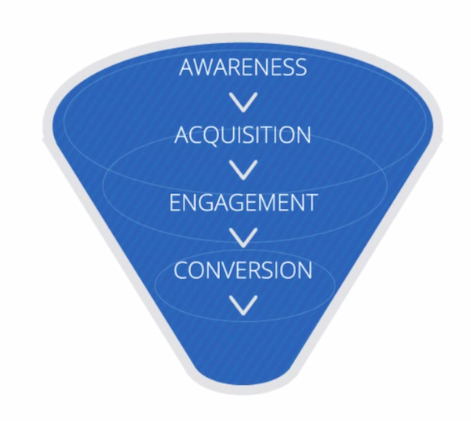
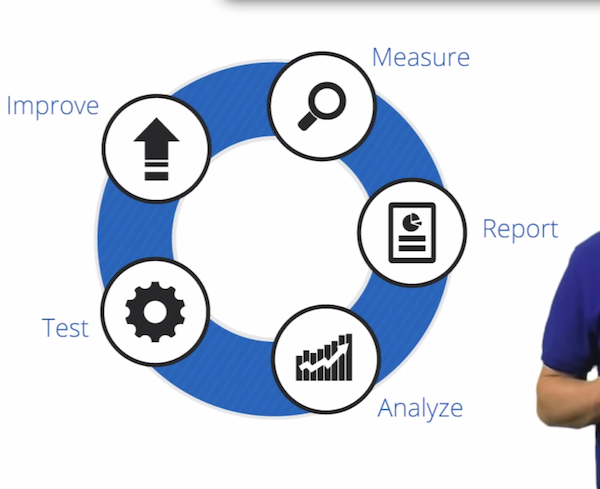
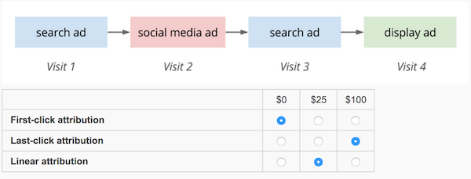

##1.A.
	Factors to bring the importance of analytics
		- Internet
		- Mobile
		- Cloud Computing

		

	- Avinash Kaushik's definition
		"Digital analytics is the analysis of qualitative and quantitative data from your business and the competition to drive a continual improvement of the online experience that your customers and potential customers have which translates to your desired outcomes (both online and offline)."

		

	-Key Elements of Google Analytics:
		- Customers:
			- Long time,we had a marketing funnel 
			(awareness > acquisition > engagement > conversion > retention)
			- the best analysis is through the customer!
			Successful, realistic, holistic information!
		- Qualitative
			- Google analytics can take large amount of data through websites
			- long time, but now has more value
			- Home appliances, mobile, game, computer, etc.
		- qualitative
			- The Why!?
				- 
		- Measuring outcomes
			- what are the important business outcomes, and what your goals are
			- good to have a good strategy 
			- 5 business objectives:
				- e-commerce: sell products
				- Lead generation: contact information for sales prospects
				- content publishing: ads shown to visitors
				- Online info: help customers and respond quickly
		- Behavioral data
			- Macro Conversions
				- main objective
			- Micro Conversions
				- smaller steps to the final goal
		

				

	- Continual improvement (Whole Process)
		- Measure: all data needed to answer business questions
		- Report: Send information for those who can use it like reporting
		- Analyze: Segmentation and hypothesis, and determine expectations (then find out why or why not it didn't meat)
		- Test: Different solutions to the problem
			- takes things out of the decision making process
		- Improve: Learn from your last cycle to make a better next cycle
		
	    - This flow should have qualitative and quantitative data to help you get to know your customers and their behaviors. 

Know the importance of genre, and how we interact with the customer and what we do with it! 

##1.B.

###Context
	-internal, from histroical data to represent benchmarks
		- Using your site's historical monthly visits data to set a future monthly visits target.
	-determine future goals
	
###Segmentation
	- how to separate (isolate and analyze)
		-days,etc.
	- Segmentation can help you find the underlying causes of changes to your aggregate data.
	- Segmentation allows you to isolate and analyze subsets of your data.
	
##1.C.

###Macro Conversion (channel 1)
	- transaction
	- Sales Leads:
		- A potential customer fills out and submits a lead form.
	
###Micro Conversion (channel 2)
	- indicator that a user is moving toward a macro conversion
	- Maximize Sales:
		- Ecommerce conversion rate
	
###Attribution is assigning credit to each conversion
	- Last Click Attribution (all the data goes to the last conversion)
		-used for years, because it was best we had)
	- Linear Attribution ??
	    - Assists
	        - Interactions occurred before the actual attributions
	        - which players assist to the end result
	    - Goals
		    -Some score goals
		    -need to know which one is used
	- First Click attribution
		- assigning assisting attribusions
		

		
General idea: better understand the journey and to determine what process is best.

##1.D.
